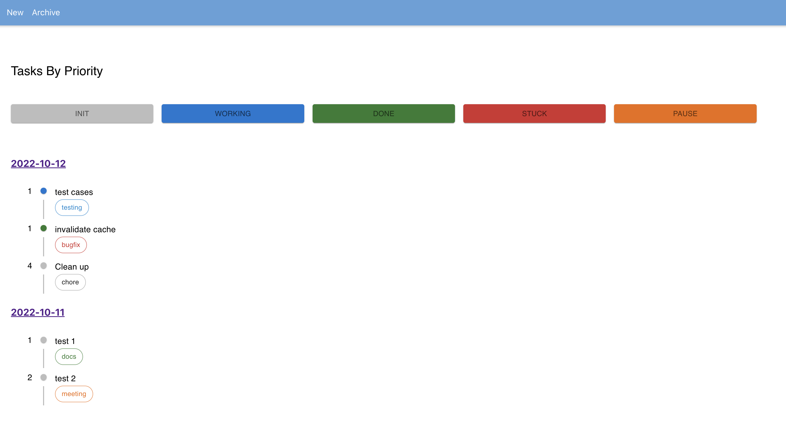

### Description



- This is a simple project to play around with `react-query`, to understand how it manages server-side states with hooks.
- The project consists of a NestJS api server and a React client app. Data that flows around is a queue of tasks, with attributes such as `description`, `priority`, `type`, and `status`. Yes, it aims to be a little more than a simple to-do list.
- I used [Material UI components](https://mui.com/material-ui/react-timeline/#main-content) to display a timeline of task items, sorted by priority

### Get Started

```
git clone https://github.com/nancyel/nestjs-react-query.git
cd nestjs-react-query
yarn install
yarn start
```

### WIP

- Add a filter functionality by priority, type, and status
